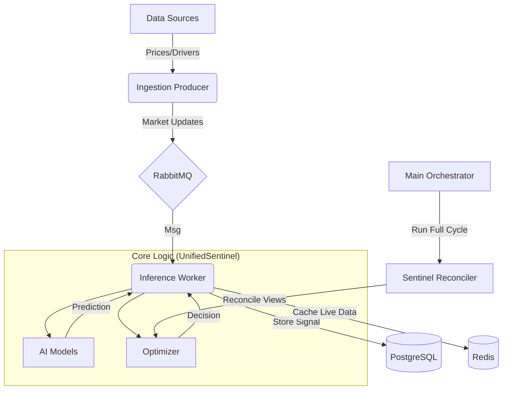

# Elsewedy Sentinel Project Explanation

This document provides a comprehensive overview of the Elsewedy Sentinel codebase, detailing the file structure, component interactions, and the data processing workflow.

## 1. Project Overview

**Sentinel** is an AI-driven supply chain intelligence system designed to optimize procurement for cable manufacturing materials (Polymers, Shielding, Screening). It tracks market prices and recommends procurement strategies ("Buy", "Wait", "Hold").

The system operates on a microservices-like architecture (managed via Docker Compose) with a Python-based core logic.

### Core Architecture

- **Data Ingestion (Layer 1)**: Fetches market data (Yahoo Finance, LME) and demand drivers (FRED).
- **AI Inference (Layer 2)**: Predicts price trends using specialized models (XGBoost, LSTM).
- **Reconciliation (Layer 3)**: Aligns granular country-level forecasts with regional/global trends.
- **Optimization (Layer 4)**: Calculates optimal order quantities considering lead times and stock levels.
- **Infrastructure**: RabbitMQ (Queue), Redis (Cache), PostgreSQL (Storage), Vault (Secrets).

---

## 2. Component Interconnections & Workflow

### The Data & Logic Flow

1. **Ingestion**: `ingestion_producer.py` polls `UnifiedSentinel` for market data and pushes updates to RabbitMQ.
2. **Processing**: `inference_worker.py` consumes messages, determines the material category, loads the appropriate AI model (via `ModelFactory`), and generates a prediction.
3. **Optimization**: The worker then calls `SentinelOptimizer` to determine if a buy is necessary based on the prediction and lead times.
4. **Storage**: Results are saved to Postgres (`ai_signals`) and Redis (`live:...`).
5. **Audit/Planning**: `main_orchestrator.py` can trigger a full top-down/bottom-up reconciliation process for strategic planning.

---

## 3. detailed File Explanations

### A. Root Configuration & Infrastructure

| File | Description |
| :--- | :--- |
| **`docker-compose.yml`** | Defines the infrastructure services: `rabbitmq` (Messaging), `redis` (Cache), `postgres` (Main DB), and `vault` (Secret management). It manages networking (`sentinel_net`) and volumes. |
| **`init.sql`** | SQL script mounted to the Postgres container. It initializes the `market_prices` (raw data) and `ai_signals` (predictions) tables on first startup. |
| **`Critical Advice for the.txt`** | Design notes highlighting data conversion units (e.g., Trade Value to Net Weight) and the importance of Lead-Time offsets for ordering. |

### B. Core Application Logic (`data_sources/`)

This directory contains the main Python executable scripts and logic classes.

| File | Description |
| :--- | :--- |
| **`unified_demand_and_prices.py`** | **The Monolith Class (`UnifiedSentinel`)**.It acts as the central data engine. It handles:  • **Config**: Defines Materials (PVC, Copper), Regions (MENA, EU), and Categories. • **Fetching**: Connects to external APIs (Yahoo Finance, UN Comtrade, FRED). • **DB**: Manages connections to Postgres. • **Helpers**: Provides methods to fetch prices, drivers, and historical data. |
| **`main_orchestrator.py`** | **The Strategic Runner**. It demonstrates the full "4-Layer" processes:  1. Init Engine  2. Get Forecasts  3. Reconcile (Regional vs Global)  4. Optimize Inventory. |
| **`ingestion_producer.py`** | **The Feed Producer**. Runs a loop that fetches current prices using `UnifiedSentinel` and publishes them to the RabbitMQ `market_updates` queue. |
| **`inference_worker.py`** | **The AI Consumer**. Listens to RabbitMQ. When a price update arrives: • Loads the correct AI model via `ModelFactory`. • Runs inference (Prediction). • Runs `SentinelOptimizer` (Decision). • Stores result in Redis and Postgres. |
| **`SentinelReconciler.py`** | **Logic Component**. Implements "Bottom-Up" (aggregate local to global) and "Top-Down" (distribute global to local) reconciliation logic to ensure forecasts are consistent across hierarchy levels. |
| **`inventoryOptimizer.py`** | **Logic Component**. Uses Linear Programming (`pulp` library) to solve for the optimal "Buy" quantity, minimizing purchase and holding costs while respecting safety stock and lead times. |
| **`live_prediction_feeder.py`** | A simplified, standalone loop (alternative to the Producer/Worker setup) that runs inference and saves to a local SQLite DB (`sentinel_predictions.db`). Likely for lightweight or local testing. |
| **`vault_client.py`** | **Infrastructure Helper**. A client for HashiCorp Vault. It securely retrieves API keys (FRED, EIA, COMTRADE, DB passwords) and falls back to environment variables if Vault is unreachable. |
| **`demand_and_prices.py`** | **Legacy/Prototype**. Seems to be a converted Jupyter Notebook (`Demand and Prices.ipynb`). Contains earlier versions of `SentinelAutomation`, `RegionalSentinel`, etc. |
| **`export_training_data.py`** | **Utility**. Fetches 5 years of historical data (Prices + Drivers) using `UnifiedSentinel` and saves it to `sentinel_training_data.csv` for model training. |

### C. AI Models (`ai_models/`)

Implements the Strategy Pattern for different model types based on material category.

| File | Description |
| :--- | :--- |
| **`model_factory.py`** | **Factory Pattern**. `ModelFactory.get_model(category)` returns the correct model instance: • `shielding` -> LSTM (Deep Learning) • `polymer` -> XGBoost • `screening` -> Croston's (Heuristic) |
| **`shielding_layers.py`** | **Deep Learning Model**. Defines `SentinelDLModel` (PyTorch LSTM/GRU) for predicting volatile metal prices (Copper, Aluminum) based on time-series sequences. |
| **`polymer_layers.py`** | **Gradient Boosting Model**. Defines `SentinelGBMModel` (XGBoost/LightGBM) for predicting Polymer prices, which are heavily driven by Oil prices (External Regressors). |

---

## 4. Key Data Structures

- **Materials**: Defined in `UnifiedSentinel`. Each has a `hs` (Harmonized System code), `symbol` (Yahoo Ticker), `category` (Polymer/Shielding/Screening), and `driver` (Oil/LME/LeadTime).
- **Regions**: Groupings of Countries (e.g., MENA = Egypt, UAE, Saudi Arabia) with associated Economic Proxies (e.g., specific FRED series).

## 5. How to Run (Inferred)

1. **Start Infrastructure**: `docker-compose up -d` (Starts RabbitMQ, Redis, Postgres, Vault).
2. **Start Worker**: `python data_sources/inference_worker.py` (Starts listening for tasks).
3. **Start Producer**: `python data_sources/ingestion_producer.py` (Starts feeding market data).
4. *(Optional)* **Run Reconcillation**: `python data_sources/main_orchestrator.py` (Runs a one-off strategic analysis).

---

## 6. Database Schema

The system uses **PostgreSQL** for persistent storage.

### 1. `market_prices`

*Stores raw price data fetched from external sources (Producer).*

| Column | Type | Description |
| :--- | :--- | :--- |
| `id` | SERIAL PK | Unique Identifier |
| `material` | VARCHAR(50) | Name of the material (e.g., 'Copper') |
| `price` | DECIMAL(10, 2) | Market price value |
| `currency` | VARCHAR(10) | Currency code (Default: 'USD') |
| `source` | VARCHAR(50) | Source of data (e.g., 'Yahoo', 'LME') |
| `captured_at` | TIMESTAMP | Time of data capture (Default: CURRENT_TIMESTAMP) |

### 2. `ai_signals`

*Stores the output of the AI Inference engine (Worker).*

| Column | Type | Description |
| :--- | :--- | :--- |
| `id` | SERIAL PK | Unique Identifier |
| `material` | VARCHAR(50) | Name of the material |
| `input_price` | DECIMAL(10, 2) | Price used for inference |
| `decision` | VARCHAR(20) | Final Recommendation ('BUY', 'WAIT', 'HOLD') |
| `confidence_score` | DECIMAL(5, 2) | Model confidence (optional) |
| `created_at` | TIMESTAMP | Time of prediction (Default: CURRENT_TIMESTAMP) |

### 3. `market_data`

*Stores comprehensive market audit data including trends and drivers (UnifiedSentinel).*

| Column | Type | Description |
| :--- | :--- | :--- |
| `id` | SERIAL PK | Unique Identifier |
| `time` | TIMESTAMP | Time of record |
| `material_id` | VARCHAR(50) | Material Name |
| `country_code` | VARCHAR(10) | UN Comtrade Country Code |
| `region` | VARCHAR(50) | Region Name (e.g., 'MENA') |
| `price` | DECIMAL(10, 2) | Current Price |
| `trend` | DECIMAL(10, 4) | Price Trend Percentage |
| `driver_val` | TEXT | Driver Value (e.g., "Oil $85.00") |

---

## 7. Scaling Strategy

For plans on how to scale this system for multiple materials and countries using a distributed event-driven architecture, please refer to [SCALING.md](SCALING.md).

---

## 8. AI Models & Workflow

---

## 9. Requirements & Validation

- **Diffentiation**: Why is Sentinel different? See [DIFFERENTIATION.md](DIFFERENTIATION.md).

For a deep dive into the features, training process, and logical workflow of each AI model (Polymer/XGBoost, Shielding/LSTM, Screening/Croston), please refer to [AI_MODELS.md](AI_MODELS.md).
