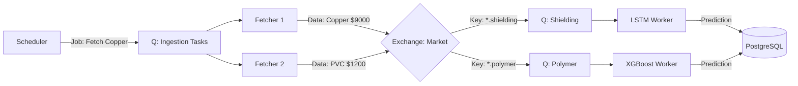

# Scalable Data Streaming & Prediction Strategy

To manage data streaming and predictions for **multiple raw materials** across **multiple countries**, you need to move from a "Loop-based" approach to a **Event-Driven Distributed Architecture**.

The current `ingestion_producer.py` loops through everything sequentially. As you scale to 50+ countries and 200+ materials, this will become too slow.

## 1. The Architecture Pattern: "Fan-Out"

### A. Distributed Ingestion (The Input)

Instead of one process fetching everything:

1. **Scheduler (The Conductor)**: A lightweight cron/scheduler (like Celery Beat or a simple Loop) that does **not** fetch data. It only pushes **"Fetch Jobs"** to a queue.
    * *Payload*: `{"task": "fetch_price", "material": "Copper", "source": "Yahoo"}`
    * *Payload*: `{"task": "fetch_demand", "country": "Egypt", "material": "Copper"}`
2. **Ingestion Workers (The Fetchers)**: Multiple identical containers that listen to the `ingestion_tasks` queue. They perform the API calls (IO-bound).
    * *Why?* API calls wait on networks. 10 workers = 10x faster fetching.

### B. Intelligent Routing (RabbitMQ Topics)

Use **Topic Exchanges** instead of a single queue.

* **Exchange**: `sentinel_market_data` (Topic Type)
* **Routing Keys**: `region.country.category.material`
  * Example: `mena.egypt.polymer.pvc`
  * Example: `eu.germany.shielding.copper`

This allows you to construct specialized pipelines.

## 2. Specialized Inference Workers (The Brain)

Different models have different compute needs (XGBoost is fast/CPU, LSTM is slow/GPU? Matrix ops).

**1. The "Polymer" Worker Group**

* **Listens to**: `*.*.polymer.*`
* **Model**: XGBoost (Oil-linked).
* **Scale**: 2 replicas (Fast).

**2. The "Shielding" Worker Group**

* **Listens to**: `*.*.shielding.*`
* **Model**: LSTM/DeepAR (Time-series).
* **Scale**: 5 replicas (Slower inference).

**3. The "Screening" Worker Group**

* **Listens to**: `*.*.screening.*`
* **Model**: Croston's Method.
* **Scale**: 1 replica (Very fast math).

---

## 3. Implementation Plan

### Step 1: Update `ingestion_producer.py`

Modify it to accept command-line arguments to "shard" the work, or split it into a **Scheduler** and **Fetcher**.

**Concept**:

```python
# scheduler.py
materials = ['Copper', 'PVC', 'Mica']
countries = ['Egypt', 'KSA', 'Germany']
for mat in materials:
    for country in countries:
        # Just queue the intent to fetch
        rabbit.publish('ingestion_tasks',json.dumps({'mat': mat, 'country': country}))
```

### Step 2: Update RabbitMQ Configuration

In `docker-compose.yml`, define explicit services for different worker types if needed, or use one generic worker image that takes an environment variable for the `TOPIC_FILTER`.

```yaml
  worker_polymer:
    image: sentinel_worker
    environment:
      - LISTEN_TOPIC=*.*.polymer.*
      - MATERIAL_CATEGORY=Polymer
    deploy:
      replicas: 3
```

### Step 3: Global State Management (Redis)

Since workers are stateless, they need a shared memory for "Stateful" features (e.g., "Has price of Copper changed since last check?").

* Continue using Redis, but key it by Region/Country: `price:egypt:copper`.

### Step 4: Batch Database Writes

Don't `INSERT` on every single prediction.

* **Pattern**: Workers push results to a `db_write_buffer` queue.
* **Writer**: A single "Persister" service pulls chunks of 100 results and does a `COPY` / Bulk Insert into PostgreSQL.

---

## 4. Visual Workflow


