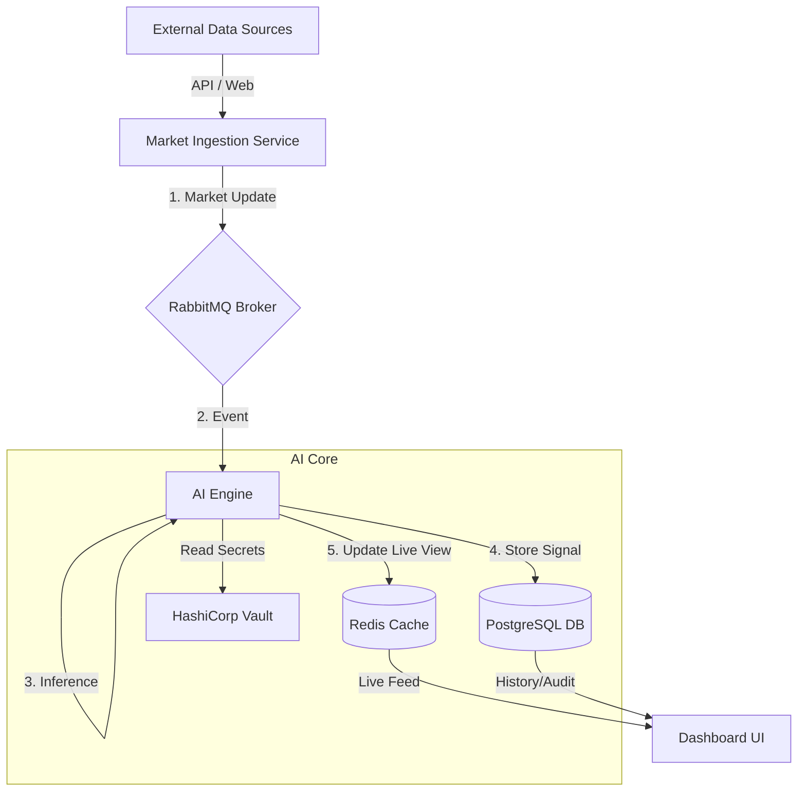

# System Architecture 🏗️

## High-Level Design

Sentinel uses an **Event-Driven Microservices Architecture**.

<!-- TODO: Generate using Prompt #1 in documents/project_process/DIAGRAM_PROMPTS.md -->

## Components

### 1. Market Ingestion (`services/market_ingestion`)

* **Role**: Producer.
* **Behavior**: Polls configured materials (Yahoo Finance, etc.) every 60 seconds. Pushes `market_updates` to RabbitMQ.
* **Resilience**: Stateless. Can be restarted at any time.

### 2. AI Engine (`services/ai_engine`)

* **Role**: Consumer & Processor.
* **Dispatcher Thread**: Consumes global updates and fans them out to country-specific tasks.
* **Worker Thread**: Processes country tasks sequentially. Runs AI Inference (XGBoost/LSTM) and Optimization logic.
* **Storage**: Writes "Hot" data to Redis (latest state) and "Cold" records to Postgres (audit trail).

### 3. Dashboard (`services/dashboard`)

* **Role**: Presentation Layer.
* **Stack**: FastAPI + Jinja2 Templates.
* **Data Strategy**:
  * **Real-time**: Reads directly from Redis.
  * **Historical**: Queries PostgreSQL.

### 4. Infrastructure

* **RabbitMQ**: Decouples Ingestion from Processing.
* **Vault**: Centralized secret management. Injects secrets into containers at startup.
